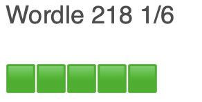

# Wordle Bot

This repo uses a browser automation to cheat and solve the [Wordle daily word puzzle](https://www.powerlanguage.co.uk/wordle/).

[Some solutions](https://github.com/TylerGlaiel/wordlebot) use a vocabulary list to guess the optimal word for each of the 6 entries allowed. Using the provided vocabulary list, this type of solution enters an optimal first word such as 'ROATE' and then filters the vocabulary list based on which letters were perfect or partial matches.

In contrast, my approach is to shamelessly cheat and provide a successful answer on the first guess.  The solution to the puzzle is in the webpage's source code in localStorage, which can be obtained with:
``
const solution = JSON.parse(localStorage.getItem('gameState')).solution
``
To run this application:
``npm install
npm run bot
``
The script uses the head-ful playwright test automation tool to:
- open the wordle homepage
- close the modal overlay
- read the solution from localStorage
- simulate a button click for each letter in the solution
- click the Enter key to 'solve' 
- click the Share button

You should be able to view the bot's activity, as playwright is using a headful rather than headless browser. The browser will close after the bot finishes.

The result of the automated script is that the success badge is copied to the OS's clipboard. You can paste the badge into your facebook or twitter feed to impress people with your genius. 

To verify that the copy/paste succeeded, you can copy random text into your clipboard before running this bot.  

